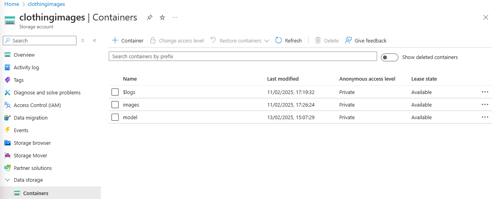

# Image classification for a refund department 
***

This project was created in order to improve the efficiency of clothing returns.  An online shopping platform 
for sustainable clothing is growing rapidly in terms of purchases, customers, and the unavoidable 
associated returns. This RESTful API was created to help relieve some of the work load of having to manually
categorize clothing orders for returns. 

## End Goal for Project

The intention for the design and creation of this application was to have it be completely integrated into
the cloud through Azure products.  This would provide improved scalability and data protection. 

## Design Goal 

The design goal:
- Create CNN (Convolutional Neural Network) clothing image classification model
    using TensorFlow tutorial and MNIST clothing dataset with KERAS
- Model to be stored remotely in Azure Blob Storage 
- Images to be batch processed every evening at 11pm stored remotely in Azure Blob Storage
- RESTful API developed using Flask, hosted on Azure Web App with Continuous Integration and 
    Continuous Deployment using GitHub Actions.
- Clothing categorization probabilities and most likely category classification stored remotely 
    using Azure SQL Server and Database

[Design Solution]

## Challenges During Implementation
- Microsoft Entra ID Security Login for SQL Database
- System Requirements and Dependencies for Containerization 

Despite being able to use GitHub Actions to successfully build and deploy the Clothing Refund Flask App, 
the app is not yet working properly in Azure Web App.  I believe it is because I have not yet been able
to adjust for the system dependencies required to download the Tensorflow model from Azure Blob Storage, 
and perhaps there may be additional dependencies to run the ODBC Driver for SQL Server.

## Current Local Solution 

While Azure Web App is currently unable to automatically batch process images, solution is currently 
running on local computer using Microsoft Task Scheduler to send curl request to initiate run.


## System Requirements 
***

- Python 3.12 +
- ODBC Driver 18 for SQL Server
- Microsoft Azure Portal Login

## Recreate Image Classification Solution
Note: Currently if all files were downloaded, access to Azure Blob Storage and Azure SQL Database 
is not accessible due to Firewall and Security Features. In order to recreate current solution, 
individual Azure Blob Storage and Azure SQL Database must be created. 

1. Create local project in VSCODE or preferred IDE 
2. Download model.ipynb and app.py
3. Create Virtual Environment using requirements.txt

``````commandline
pip install -r requirements.txt
``````

4. Run model.ipynb which will create a local file named: 'clothing_model.keras'

5. Log in to Microsoft Azure Portal 
6. Create a Resource Group which will contain all resources for the ClothingRefundFlaskApp


7. Create an Azure Storage Account named: clothingimages


6. Create two containers within Azure Storage Account: 
    - images (stores all in coming images to be processed.)
      (For Testing Purposes file named images/ClothingImages in GitHub Repository may be used)
    - model (stores TensorFlow model 'clothing_model.keras')


7. Store files in corresponding containers.


8. In app.py update account_key variable (line 20)
   - account_key = 'xxxxxxx'
     - This information is found in Microsoft Azure Storage Account under Security + Networking tab: 
       - Access keys
       - Copy key1 and insert into account_key string variable


9. Create Azure SQL Server and Database to store clothing category probabilities and image classification data.
    In Security: Make sure to select SQL Server Authentication only.


10. Using Query editor log in with SQL Server Authentication to create two tables to store image predictions 
and image probabilities. 

- Select New Query: 
- Run Script: 
- 


- Run Flask APP locally 
``````commandline
flask run
``````

- Set up Microsoft Task Scheduler creating a Basic Task to initiate batch processing 
    Under Actions Tab:
    1. Select New
    2. Name: Batch Processing
    3. Action: Start a Program
    4. Settings: 
         - Program/Script: curl
         - Add arguments:
          ``````commandline
          curl -X POST "http://127.0.0.1:5000/prediction" -H "Content-Type: application/json"
          ``````
    5. Triggers tab: 
       - Daily 
       - At 23:00 every day
       - Satus: Enabled

